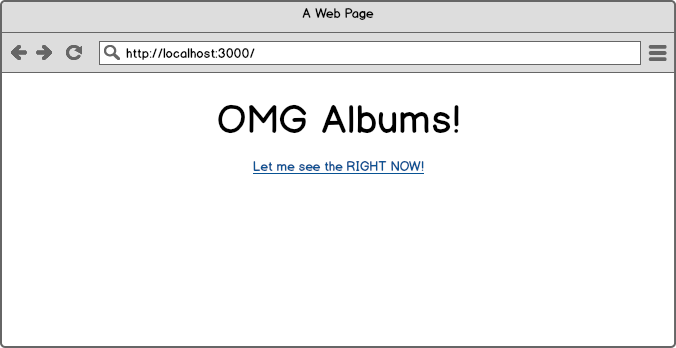
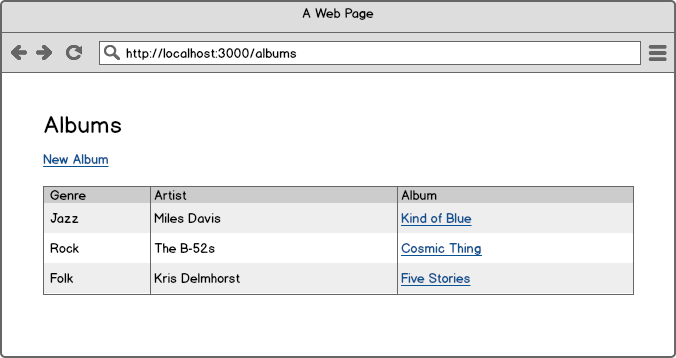
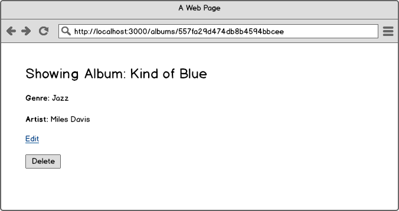
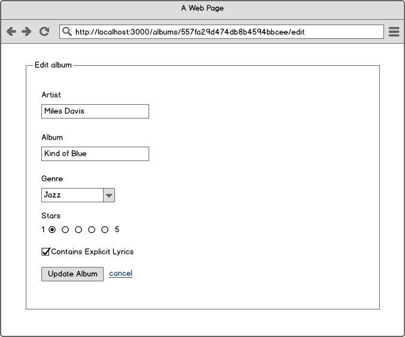

# CRUD with Express/Mongo

## Setup

```
npm install
```

Run the app with:

```
nodemon
```

## Instructions

### Create the index page

Add the heading the and the link to `/albums`

**Create albums index**

Create a new routes file for albums:

```
touch routes/albums.js
```

Wire up the routes file in `app.js`

```js
var albums = require('./routes/albums');
app.use('/', albums);
```

Write the albums index route:

```js
var express = require('express');
var router = express.Router();

router.get('/albums', function(req, res, next) {
  res.render('albums/index');
});
```

Create the albums template:

```
mkdir views/albums
touch views/albums/index.jade
```

Populate the albums index:

```
extends ../layout

block content
  h1 Albums

  a(href="/albums/new") New Album
```

### Create the "new" page

Create the `/albums/new` route:

```js
router.get('/albums/new', function(req, res, next) {
  res.render('albums/new');
});
```

Create the `/albums/new.jade` template:

```
extends ../layout

block content
  h1 New Album

  form(action="/albums", method="post")
    div
      Name
      input(type="text" name="album_name")

    div
      input(type="submit")
```

### Create the "create" route

Create the `/albums` route:

```js
router.post('/albums', function(req, res, next) {
  res.redirect('/albums');
});
```

Now you have the basic flow setup, it's time to add Mongo.

### Adding mongo to create

We'll talk to Mongo using Monk: https://github.com/Automattic/monk

First, install monk:

```
npm install monk --save
```

In `routes/albums.js` establish a connection to the database:

```js
var db = require('monk')('localhost/album-demo');
var albumCollection = db.get('albums');
```

Then in your create route, insert the data:

```js
router.post('/albums', function(req, res, next) {
  albumCollection.insert({ name: req.body.album_name });
  res.redirect('/albums');
});
```

Now when you run your code you'll be inserting data into the database.  To check, run:

```
mongo album-demo
```

From within the mongo shell, run:

```
db.albums.find({})
```

You should see something like:

```
{ "_id" : ObjectId("557fa29d474db8b4594bbcee"), "name" : "Hello" }
```

---

### STOP - Create a sequence diagram

Describe what's happening.  Start with:

```
participant Browser
participant Express
participant Mongo

# put your code here
```

Paste your image here.

---

### Showing all albums on the index page

Update the index route to pull all records from the database:

```js
router.get('/albums', function(req, res, next) {
  albumCollection.find({}, function (err, records) {
    res.render('albums/index', {allAlbums: records});
  });
});
```

Add the following table to the `block content` section of `views/albums/index.jade`

```
  table
    thead
      tr
        th ID
        th Name
    tbody
      for album in allAlbums
        tr
          td= album._id
          td= album.name
```

### Create the show page

Add a link to the show page:

```
  table
    thead
      tr
        th ID
        th Name
    tbody
      for album in allAlbums
        tr
          td= album._id
          td
            a(href='/albums/' + album._id)= album.name
```

Add the show page route:

```js
router.get('/albums/:id', function(req, res, next) {
  albumCollection.findOne({_id: req.params.id}, function (err, record) {
    res.render('albums/show', {theAlbum: record});
  });
});
```

Create the show page:

```
touch views/albums/show.jade
```

```
extends ../layout

block content
  h1= theAlbum.name

  a(href="/albums/" + theAlbum._id + '/edit') Edit
```

### Your turn!! - Edit / Update

OK - now you have everything you need in order to create your edit/update view.  Here's what you have to do:

- Create an edit route
- Create a form (see the edit wireframe below) that has the fields from the album pre-populated
- The form should post to `/albums/:id/update`
- The update route should update that record, and redirect to the show page

You can put _almost_ all of this together yourself:

- You can see how to define dynamic routes from the show route
- You can see how to find the individual record from the show route
- You know how to update a mongo doc at the command line, and you have a link to the [Monk docs](https://github.com/Automattic/monk) so you can figure out how to make the update
- You know how to redirect from the create route

The hardest part will be getting the select field to be preselected.  [This answer](http://stackoverflow.com/a/10368381/4229462) should help with that.

---

### BUT STOP - Create a sequence diagram _first_

Draw a sequence diagram of what the update action will be.  Include the redirect to the show page.

```
participant Browser
participant Express
participant Mongo

# put your code here
```

Paste your image here.

---


### And finally, delete

Delete's a little tricky.  You need to add a form to the show page that will post to `/albums/:id/delete`.

Then add your delete route that will remove the document from the collection, and also redirect to the index page.

# Wireframes

Pay attention to the URLs.









